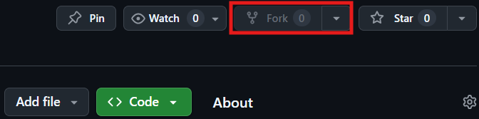
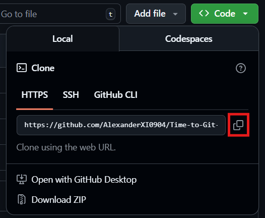
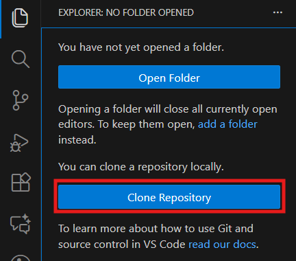

# Fork the repository
Fork this repository by **clicking on the fork button** on the top of this page. This will create a copy of this repository in your account.

# Clone the repository

Now clone the forked repository to your machine. Go to your GitHub account, open the forked repository, click on the code button, then on HTTPS tab and then **click the copy url** to clipboard icon.

Then open a new window in VS Code. Go to the folder icon (the first icon). click the clone repository icon.

After that paste the url that you have just copied.

# Create a branch

# Make necessary changes and commit those changes
Now open Contributors.md file in a text editor, add your name to it. Don't add it at the beginning or end of the file. Put it anywhere in between. Now, save the file.

git status

If you go to the project directory and execute the command git status, you'll see there are changes.

Add those changes to the branch you just created using the git add command:

git add Contributors.md
Now commit those changes using the git commit command:

git commit -m "Add your-name to Contributors list"
replacing your-name with your name.

Push changes to GitHub
Push your changes using the command git push:

git push -u origin your-branch-name
replacing your-branch-name with the name of the branch you created earlier.

If you get any errors while pushing, click here:
Submit your changes for review
If you go to your repository on GitHub, you'll see a Compare & pull request button. Click on that button.

compare and create pull request

Now submit the pull request.

submit pull request

Soon I'll be merging all your changes into the main branch of this project. You will get a notification email once the changes have been merged.

Where to go from here?
Congrats! You just completed the standard fork -> clone -> edit -> pull request workflow that you'll often encounter as a contributor!

Celebrate your contribution and share it with your friends and followers by going to web app.

If you'd like more practice, checkout code contributions.

Now let's get you started with contributing to other projects. We've compiled a list of projects with easy issues you can get started on. Check out the list of projects in the web app.