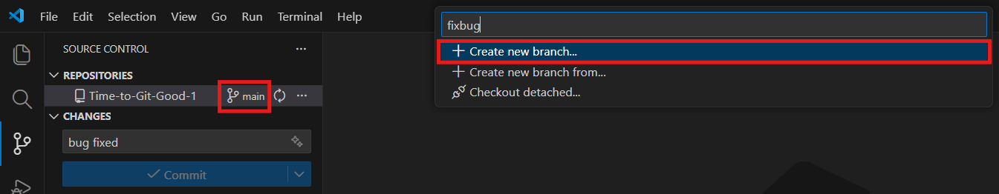
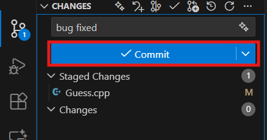
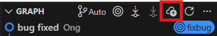
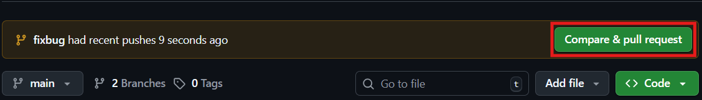
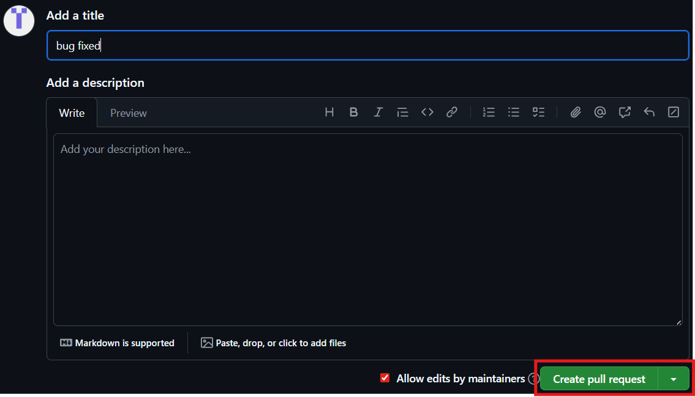

# Welcome to BSL Week 9 (2025/26): Time to Git Good
This project will guide students to make their first contribution here on GitHub.

Follow the steps below:

# Fork the repository
Fork this repository by **clicking the Fork button** at the top of this page. This will create a copy of the repository in your own GitHub account.

# Clone the repository

Next, clone the forked repository to your machine.
1. Go to your GitHub account and open the forked repository
2. Click on the **Code button**
3. Choose the **HTTPS tab**
4. **Copy the URL** using the copy-to-clipboard icon.

Then, open a new window in VS Code. On the left sidebar, click the **Explorer (folder) icon**, then click the **Clone Repository** icon.

**Paste the url** you copied earlier.

# Create a branch
Click the **Source Control** icon (third icon on the left). Under *Repositories*, click the **branch name (main)** and **create a new branch**. Give your branch a meaningful name.

# Spot the errors and commit the changes
Open **Guess.cpp**, look through the code and fix the errors. After saving your changes:
1. **Stage** the modified files
2. Write an appropriate commit message
3. Click the **Commit** button

# Push changes to GitHub
Since this is a brand-new branch, you must **publish** it before pushing. Under *Graph*, click the **Publish Branch (cloud with up-arrow)** icon.

# Compare and create pull request
Visit your repository on GitHub. You should see a **Compare & pull request** button. Click it.

Then proceed to **create the pull request**.

Submit the pull request.

# Done!
Congrats! You've completed the standard **Fork -> Clone -> Edit -> Pull request** workflow, a process that you'll often encounter as a contributor!

You've just mastered the final part of **Bengkel Siswa Lestari (2025/26) Week 9: Time to Git Good**! It's time to Git good!

# More resources
Click this for the slide: [Time to Git Good Slide](https://www.canva.com/design/DAG55Fw70P8/VjVeRxna1KdJI0tHBOaPjQ/edit?utm_content=DAG55Fw70P8&utm_campaign=designshare&utm_medium=link2&utm_source=sharebutton).